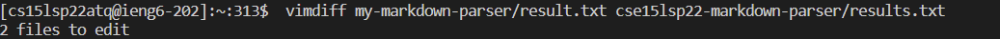
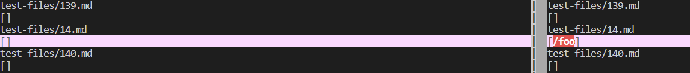
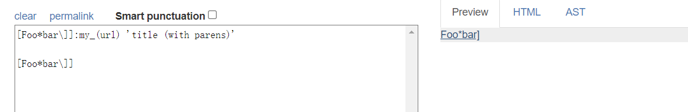
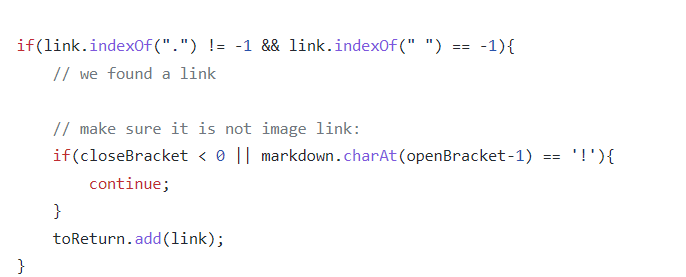
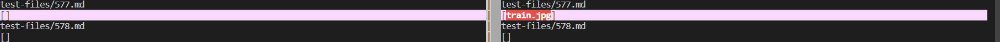
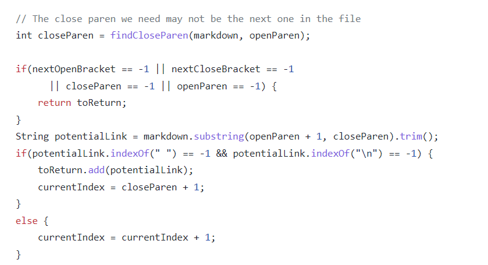

# Test 1
[Test 194](https://github.com/nidhidhamnani/markdown-parser/blob/main/test-files/194.md?plain=1)

We use `vimdiff` to find the different results.

Actual output:

Expect output (using [the CommonMark demo site](https://spec.commonmark.org/dingus/)):

Should be `"my_(url)"`

` `

TA's code is correct.

The problem is that I don't even know this can represent a link, here is a official link reference definition for Markdown command:

`A link reference definition consists of a link label, indented up to three spaces, followed by a colon (:), optional whitespace (including up to one line ending), a link destination, optional whitespace (including up to one line ending), and an optional link title, which if it is present must be separated from the link destination by whitespace. No further non-space characters may occur on the line.`

Unfortunately, this means it is impossible to fix this bug without rewriting most of my original code. My code search on link based on the specific structure ``. Since this is not the only structure to reference a link, my code will not work in this case.

The code that need to be fixed:

` `

# Test 2
Again we use `vimdiff` to find the different results.

[Test 577](https://github.com/nidhidhamnani/markdown-parser/blob/8dd87e6914ae40a4321aac8e2483e349de40b03c/test-files/577.md?plain=1)

Actual output:

Expect output:
` `

Should be `[]`.

The problem is that the code can not distinguish between a link and an image. To fix this we simply need to add a condition somewhere into the following lines.

` `

