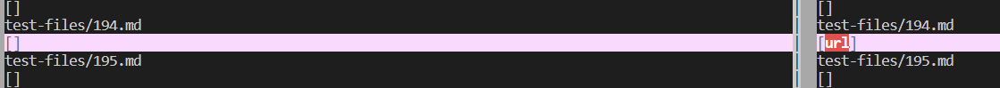

# Test 1
[Test 194](https://github.com/nidhidhamnani/markdown-parser/blob/main/test-files/194.md?plain=1)

We use `vimdiff` to find the different results.

Actual output:

Expect output (using [the CommonMark demo site](https://spec.commonmark.org/dingus/)):

Should be `"my_(url)"`

# Test 2
Again we use `vimdiff` to find the different results.

[Test 577](https://github.com/nidhidhamnani/markdown-parser/blob/8dd87e6914ae40a4321aac8e2483e349de40b03c/test-files/577.md?plain=1)

Actual output:

Expect output:

The problem is that the code can not distinguish between a link

