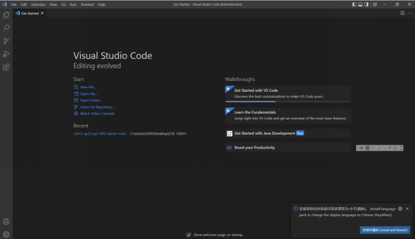
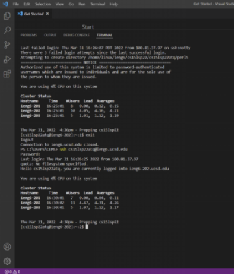
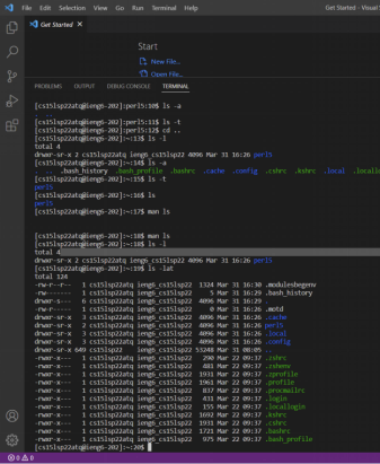
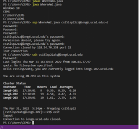
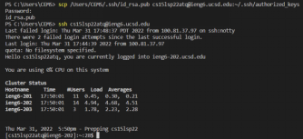

This is a tutorial about how to log into a course-specific account on `ieng6` and some basic commands that work with filesystems.
***
# Step1：Installing VScode
First go to the website [Visual Studio Code](https://code.visualstudio.com/) to download and install the Visual Studio Code.

If the install is successful, you should be able to open a window like this:

# Step2：Remotely Connecting
There are several substeps here:

-[Install OpenSSH](https://docs.microsoft.com/en-us/windows-server/administration/openssh/openssh_install_firstuse)

-[Look up your course-specific account](https://sdacs.ucsd.edu/~icc/index.php)

-Open a new terminal in VScode and enter the command `ssh cs15lsp22zz@ieng6.ucsd.edu` with the `zz` replaced by your course-specific account. If this is the first time you connect, then you will receive message like:

`The authenticity of host 'ieng6.ucsd.edu (128.54.70.227)' can't
be established.
RSA key fingerprint is
SHA256:ksruYwhnYH+sySHnHAtLUHngrPEyZTDl/1x99wUQcec.
Are you sure you want to continue connecting
(yes/no/[fingerprint])?`

type `yes` and enter your password(it will not show up in your terminal) and you should log in successfully.

# Step3: Trying Some Commands
In this step I tried to figure out what `ls -lat` means. Using the command of `man` I get :

-a means all

-l means using a long listing format

-t means sorting by modification time, newest first

So “ls -lat” means using a long listing format to list all files with newest first.

More commands and their meanings can be found by using command `man`.

# Step4：Moving Files with `scp`
The command `scp` allows us to copy a file from our computer(the client) to a remote computer(the server) without logging in.

Durring the class we practiced to copy a java program `WhereAmI.java` to the remote computer. We run the command:(again, `zz` should be replaced)

`scp WhereAmI.java cs15lsp22zz@ieng6.ucsd.edu:~/`

After logging in we can use `ls` to see that our java file. Also we can use `javac` and `java` to compile and run the program. 

# Step5：Setting an SSH Key
`SSH keys` allows us to log into the server without typing the password. Here is how we can do this:

1)On your own computer, use `ssh-keygen` to generate both a public and a private key. 

2)Save them on your computer by typing `Users/<user-name>/.ssh/id_rsa`. The `<user-name>` is the username of your computer.

3)Create a `.ssh` directory on your account on the sever. 

4)Copy the public key to that `.ssh` directory:

`scp /Users/<user-name>/.ssh/id_rsa.pub
cs15lsp22zz@ieng6.ucsd.edu:~/.ssh/authorized_keys`

Then you can log in to the sever without typing the password.

# Step6: Optimizing Remote Running
Some seperated commands can be combined into a one-line command. Using them efficiently will help us a lot.

For example,

1)You can write a command in quotes at the end of an ssh command to directly run it on the remote server, then exit. For example, this command will log in and
list the home directory on the remote server:

`ssh cs15lsp22zz@ieng6.ucsd.edu "ls"`

2)You can use semicolons to run multiple commands on the same line in most terminals. For example: the command `ssh cs15lsp22atq@ieng6.ucsd.edu "javac WhereAmI.java; java WhereAmI` both compiles and runs the WhereAmI.java file. 

