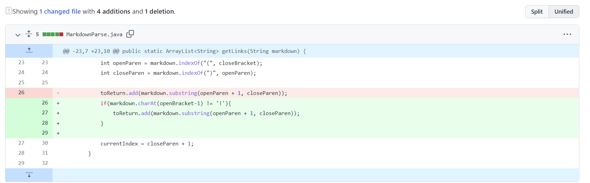
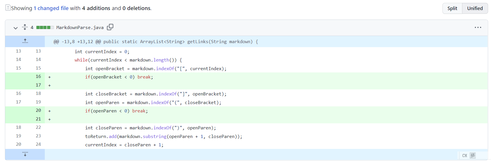

# Code 1

Screenshot

[Failure-inducing input](https://github.com/EdwardNew/markdown-parser/commit/72f6227ba4305d898c5b22590aa57968cbedff55)

The output of running the file:

`[https://encrypted-tbn0.gstatic.com/images?q=tbn:ANd9GcS4uH0CBY9a_Ox4iKsBqj1zJOuoZDdjYDkT4-1eq7PocV9EvV_2WM0A4c7pf2IPAwTJrtI&usqp=CAU]
`

The symptom is the code will return the content inside the "()" when it is an image URL. The failure-inducing input contains an image URL in Markdown format.The bug is the code can't distinguish between an image URL and an actual link.

# Code 2
Screenshot

[Failure-inducing input](https://github.com/SHENGMINGC/markdown-parser/blob/c281089a51c4598eb5c61b3adeefeaf46254ca3b/new-test.md)

The output of running the file:

`[explaination]
`

The symptom is the code will return the content in "()" even if there is a sentence between the "[]" and "()". The failure-inducing input is exactly of this type. So one bug of this code is that the code assumes any adjacent pair of "[]" and "()" contains a link, but this is not always the case.

# Code 3
Screenshot

[Failure-inducing input](https://github.com/Joshjppark/markdown-parser/blob/a730bb5a104234452fc0389fdb2dcd339273f477/test1.md)

The output of running the file:

`Exception in thread "main" java.lang.OutOfMemoryError: Java heap space
        at java.base/java.util.Arrays.copyOf(Arrays.java:3511)
        at java.base/java.util.Arrays.copyOf(Arrays.java:3480)
        at java.base/java.util.ArrayList.grow(ArrayList.java:237)
        at java.base/java.util.ArrayList.grow(ArrayList.java:244)
        at java.base/java.util.ArrayList.add(ArrayList.java:454)
        at java.base/java.util.ArrayList.add(ArrayList.java:467)
        at MarkdownParse.getLinks(MarkdownParse.java:21)
        at MarkdownParse.main(MarkdownParse.java:34)`

The symptom is the code will run into an infinite loop and crashed. The failure-inducing input is a file that ends up with a link. So the bug is that the code has no way to stop the while loop