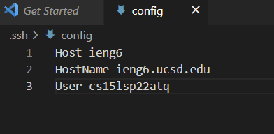
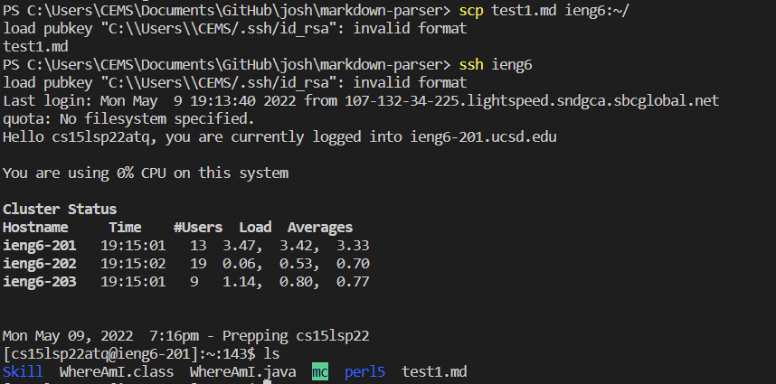

# Streamlining ssh Configuration

1) Editing the `.ssh/config` file:

2) Simplified `ssh` command using the new alias:

3) `scp` using the new alias:

# Setup Github Access from ieng6(the user account)

The purpose of this step is to use command line to modify, commit and push  the file.

1) Storing my public key on Github:

2) Storing my public and private key on my user account:

3) Running git commands to commit and push a change to
Github while logged into my user account:

4) Link for the resulting commit:
[link](https://github.com/SHENGMINGC/Josh/commits/main/test-file.md)

# Copy whole directories with scp -r

1) Copying my whole directory to my user account:

2) Logging into my user account and compiling and running the tests:

3) Combining `scp`, `;`, and `ssh` in one line and compile and run: 

